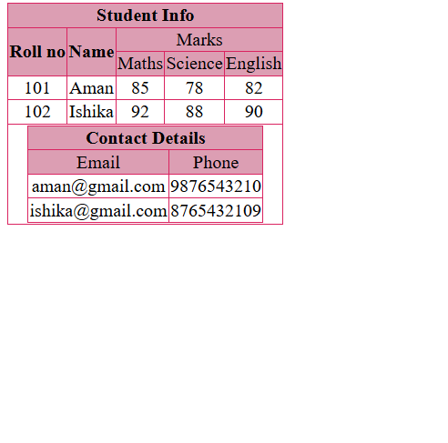

# 📊 Nested Table in HTML

A simple HTML project demonstrating how to create a **nested table** using HTML table elements, along with **rowspan** and **colspan**.

## 📌 About the Project

This project creates a **Student Information Table** containing:

* Student Roll Number
* Student Name
* Marks in Maths, Science, and English
* A nested **Contact Details** table containing Email and Phone Number

The project also uses basic CSS to style the tables and improve their appearance.

## 🛠️ Technologies Used

* **HTML5** – To create the structure of the tables
* **CSS3** – To add borders, alignment, colors, and spacing

## ✨ Concepts Covered

* `<table>`
* `<thead>` and `<tbody>`
* `<tr>`, `<th>`, and `<td>`
* `rowspan`
* `colspan`
* **Nested Tables**
* Basic CSS styling
* `margin: auto`

## 📋 Table Structure

### Main Table

The main table contains:

| Roll No | Name   | Maths | Science | English |
| ------: | ------ | ----: | ------: | ------: |
|     101 | Aman   |    85 |      78 |      82 |
|     102 | Ishika |    92 |      88 |      90 |

### Nested Table

The main table also contains a nested table for contact information:

| Email                                       | Phone      |
| ------------------------------------------- | ---------- |
| [aman@gmail.com](mailto:aman@gmail.com)     | 9876543210 |
| [ishika@gmail.com](mailto:ishika@gmail.com) | 8765432109 |

### Project Screenshot


## 🎯 Purpose

The purpose of this project is to practice **HTML tables**, especially `rowspan`, `colspan`, and **nested tables**, while learning how to structure and style tabular data.

## 📁 File Structure

```text
Nested-Table/
│
└── index.html
```

## 🚀 How to Run

1. Download or clone this repository.
2. Open `index.html` in a web browser.
3. The Student Information table with the nested Contact Details table will be displayed.

## 📚 What I Learned

Through this project, I practiced creating structured tables in HTML and learned how tables can be combined using **nested tables**, along with `rowspan` and `colspan` for organizing data.

---

⭐ **Beginner HTML Practice Project**
